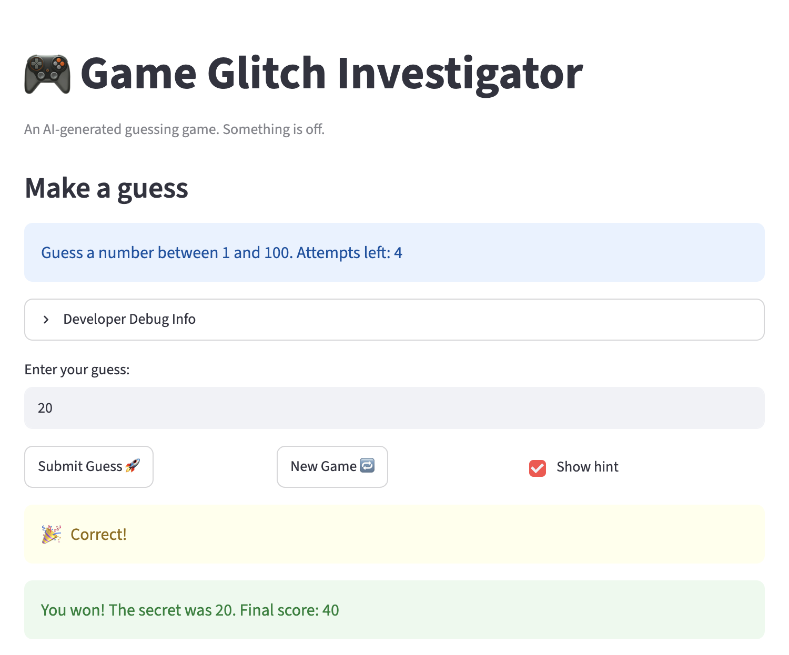

# 🎮 Game Glitch Investigator: The Impossible Guesser

## 🚨 The Situation

You asked an AI to build a simple "Number Guessing Game" using Streamlit.
It wrote the code, ran away, and now the game is unplayable. 

- You can't win.
- The hints lie to you.
- The secret number seems to have commitment issues.

## 🛠️ Setup

1. Install dependencies: `pip install -r requirements.txt`
2. Run the broken app: `python -m streamlit run app.py`

## 🕵️‍♂️ Your Mission

1. **Play the game.** Open the "Developer Debug Info" tab in the app to see the secret number. Try to win.
2. **Find the State Bug.** Why does the secret number change every time you click "Submit"? Ask ChatGPT: *"How do I keep a variable from resetting in Streamlit when I click a button?"*
3. **Fix the Logic.** The hints ("Higher/Lower") are wrong. Fix them.
4. **Refactor & Test.** - Move the logic into `logic_utils.py`.
   - Run `pytest` in your terminal.
   - Keep fixing until all tests pass!

## 📝 Document Your Experience

- [ ] Describe the game's purpose.
This is an AI generated number guessing game where the player needs to guess the secret number within given range to win. It allows fixed number of attempts based on difficulty level.

- [ ] Detail which bugs you found.
- Hints for guessed number were reversed.
- Range shown in info bar was static and did not change per difficulty level.
- New game button does not work.
- Total attemps allowed was less by 1.
- Textbox does not clear when Submit button is pressed and state does not get updated.
- If we change game difficulty level mid-way during playing, secret number does not reset.

- [ ] Explain what fixes you applied.
- Fixed comparison logic in function providing hint.
- Fixed info statement to display correct range.
- Initialized attempts to 0 to total attempts was equal to those allowed.
- Reset all session state variables when starting a new game.
- Removed simulated glitchy behaviour from code.


## 📸 Demo Walkthrough

Describe your fixed game in numbered steps so a reader can follow along without watching a video:

1. User enters guess of 10
2. Game returns "Too Low", reduces attempts left by 1.
3. Score and history update correctly after each guess.
4. User enters a guess of 20 → Game returns "Too Low"
5. User enters a guess of 30 → Game returns "Too High"
6. User enters a guess of 25 → Game returns "Too Low"
7. User enters 28, Game ends after the correct guess.

**Screenshot** *(optional)*: 


## 🧪 Test Results

```
python3 -m pytest test_logic_utils.py -v
=================================================================== test session starts ===================================================================
....                                                                

test_logic_utils.py::test_parse_guess PASSED                                                                                                        [ 33%]
test_logic_utils.py::test_get_range_for_difficulty PASSED                                                                                           [ 66%]
test_logic_utils.py::test_check_guess PASSED                                                                                                        [100%]
==================================================================== 3 passed in 0.01s ====================================================================
```

## 🚀 Stretch Features

- [ ] [If you choose to complete Challenge 4, describe the Enhanced UI changes here — a screenshot is optional]
